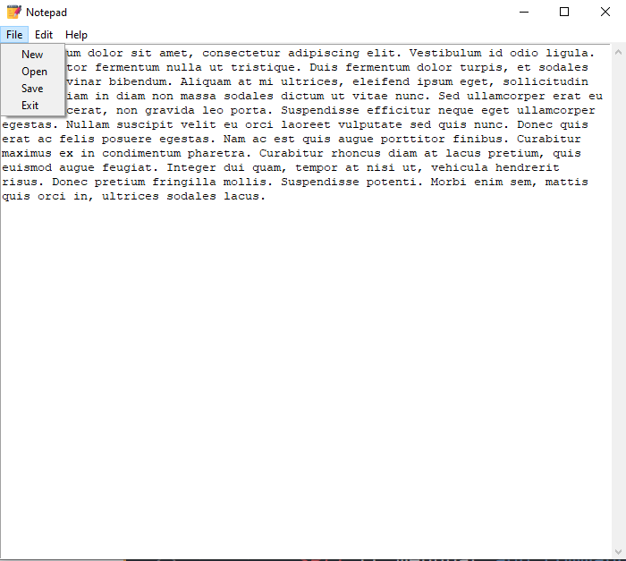

# Notepad-App
A simple notepad app in Python made using Tkinter. This GUI has 3 menus which are File, Edit and Help, using which all services like saving the file, opening a file, editing, cutting, copying and pasting can be done.
# Installation
<b>NO EXTERNAL LIBRARIES NEEDED!</b>
# Preview

